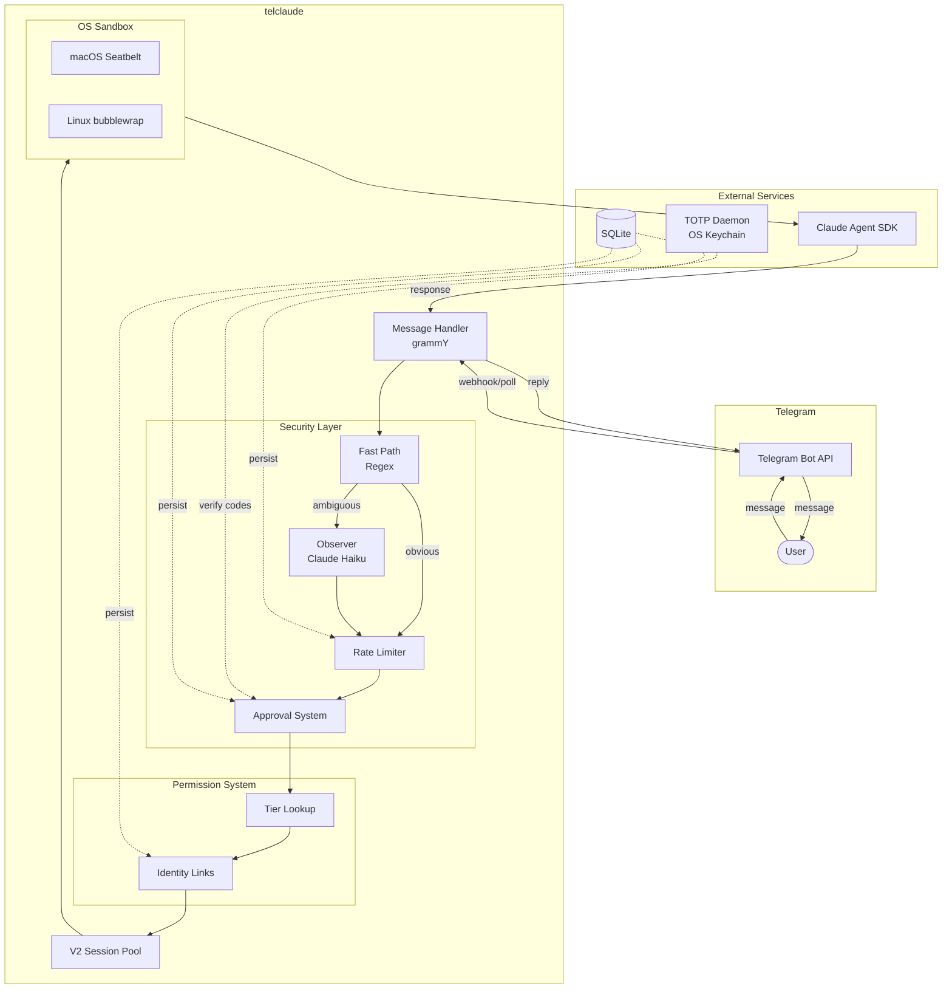
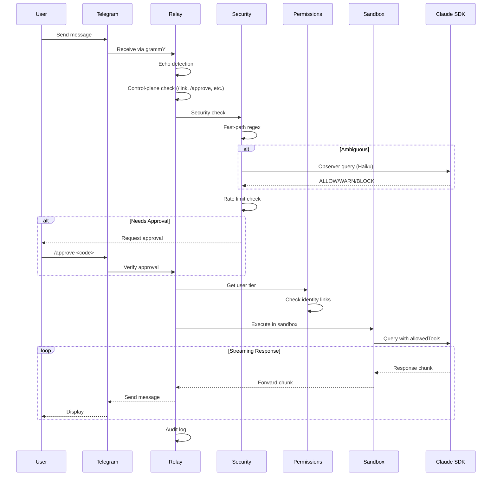
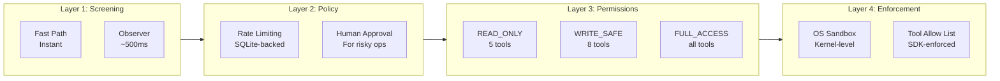
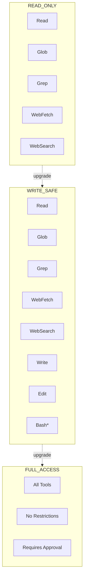
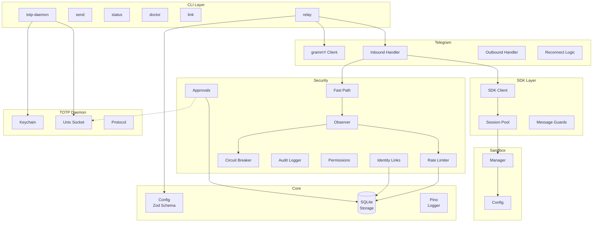

# telclaude

> Secure Telegram-Claude bridge with LLM-based command screening and tiered permissions

[](https://github.com/avivsinai/telclaude/actions/workflows/ci.yml)
[](LICENSE)
[](https://nodejs.org/)
[](https://www.typescriptlang.org/)
[](https://pnpm.io/)

---

## Overview

Telclaude bridges Telegram with Claude AI, enabling you to interact with Claude Code through Telegram messages. Unlike simple chatbot wrappers, telclaude implements a comprehensive security layer designed for real-world deployment where Claude has access to your development environment.

### Key Features

- **Telegram Bot API** via grammY (stable, official API)
- **Security Observer** — LLM-powered message screening before execution
- **Tiered Permissions** — READ_ONLY, WRITE_SAFE, FULL_ACCESS with fine-grained tool control
- **OS-Level Sandbox** — Kernel-enforced isolation (Seatbelt/bubblewrap)
- **Rate Limiting** — Per-user, per-tier, and global limits
- **TOTP 2FA** — Separate daemon with OS keychain storage
- **Session Pooling** — Persistent SDK connections for low latency
- **Audit Logging** — Full interaction history for compliance

---

## Table of Contents

- [Architecture](#architecture)
- [Quick Start](#quick-start)
- [Configuration](#configuration)
- [Security Model](#security-model)
- [CLI Reference](#cli-reference)
- [Development](#development)
- [Troubleshooting](#troubleshooting)
- [Contributing](#contributing)
- [License](#license)

---

## Architecture

### High-Level Overview



### Message Flow



### Security Layers



### Permission Tiers



> **Note**: WRITE_SAFE Bash blocks: `rm`, `rmdir`, `mv`, `chmod`, `chown`, `kill`, `pkill`, `sudo`, `su`

### Component Diagram



---

## Quick Start

### Prerequisites

- **Node.js 22+** — [Download](https://nodejs.org/)
- **pnpm** — `npm install -g pnpm`
- **Claude CLI** — `brew install anthropic-ai/cli/claude` (macOS)
- **Telegram Bot Token** — Get one from [@BotFather](https://t.me/BotFather)

### Installation

```bash
# Clone the repository
git clone https://github.com/avivsinai/telclaude.git
cd telclaude

# Install dependencies
pnpm install

# Build
pnpm build
```

### Setup

```bash
# 1. Authenticate with Claude
claude login

# 2. Configure environment
cp .env.example .env
# Edit .env and set TELEGRAM_BOT_TOKEN

# 3. Create config (optional - uses sensible defaults)
mkdir -p ~/.telclaude
cat > ~/.telclaude/telclaude.json << 'EOF'
{
  "telegram": {
    "allowedChats": []
  }
}
EOF

# 4. Verify setup
pnpm dev doctor

# 5. Start the relay
pnpm dev relay --verbose
```

### First Message

1. Open Telegram and start a chat with your bot
2. Send any message
3. Claude will respond through the relay

---

## Configuration

Configuration file: `~/.telclaude/telclaude.json`

```jsonc
{
  // Telegram settings
  "telegram": {
    "allowedChats": [123456789],  // Empty = allow all
    "polling": {
      "timeout": 30,
      "limit": 100
    }
  },

  // Security configuration
  "security": {
    "observer": {
      "enabled": true,
      "maxLatencyMs": 2000,
      "dangerThreshold": 0.7,
      "fallbackOnTimeout": "block"
    },
    "permissions": {
      "defaultTier": "READ_ONLY",
      "users": {
        "tg:123456789": {
          "tier": "WRITE_SAFE",
          "rateLimit": { "perMinute": 20, "perHour": 100 }
        }
      }
    },
    "rateLimits": {
      "global": { "perMinute": 100, "perHour": 1000 },
      "perUser": { "perMinute": 10, "perHour": 60 }
    }
  },

  // Session behavior
  "inbound": {
    "reply": {
      "enabled": true,
      "timeoutSeconds": 600,
      "session": {
        "scope": "per-sender",
        "idleMinutes": 30,
        "resetTriggers": ["/new", "/reset"]
      }
    }
  }
}
```

### Environment Variables

| Variable | Required | Description |
|----------|----------|-------------|
| `TELEGRAM_BOT_TOKEN` | Yes | Bot token from @BotFather |
| `TELCLAUDE_CONFIG` | No | Custom config file path |
| `TELCLAUDE_LOG_LEVEL` | No | `debug` / `info` / `warn` / `error` |
| `TELCLAUDE_TOTP_SOCKET` | No | Custom TOTP daemon socket path |

---

## Security Model

### Defense in Depth

Telclaude implements four security layers:

| Layer | Component | Purpose | Latency |
|-------|-----------|---------|---------|
| **1. Screening** | Fast Path + Observer | Block dangerous prompts | 0-500ms |
| **2. Policy** | Rate Limiter + Approvals | Prevent abuse, human-in-loop | 0ms |
| **3. Permissions** | Tier System | Control tool access | 0ms |
| **4. Enforcement** | OS Sandbox | Kernel-level isolation | 0ms |

### Permission Tiers

| Tier | Tools | Use Case |
|------|-------|----------|
| `READ_ONLY` | Read, Glob, Grep, WebFetch, WebSearch | Safe exploration |
| `WRITE_SAFE` | + Write, Edit, Bash (restricted) | Development work |
| `FULL_ACCESS` | All tools, no restrictions | Admin tasks (requires approval) |

### OS Sandbox

All Claude queries execute inside an OS-level sandbox:

- **macOS**: Seatbelt (`sandbox-exec`) — kernel-level enforcement
- **Linux**: bubblewrap — namespace-based isolation

The sandbox blocks access to:
- `~/.telclaude/` (config and secrets)
- `~/.ssh/`, `~/.gnupg/`, `~/.aws/` (credentials)
- System configuration files

### TOTP 2FA

Two-factor authentication runs as a separate daemon:

```bash
# Start the TOTP daemon
telclaude totp-daemon &

# TOTP secrets are stored in OS keychain (never exposed to Claude)
```

This isolation ensures that even if Claude is compromised via prompt injection, it cannot access 2FA secrets.

---

## CLI Reference

```bash
telclaude <command> [options]
```

### Commands

| Command | Description |
|---------|-------------|
| `relay` | Start the message relay |
| `send <chatId> <message>` | Send a message to a chat |
| `status` | Show current status |
| `doctor` | Health check (CLI, skills, sandbox, TOTP) |
| `link <user-id>` | Generate identity link code |
| `totp-daemon` | Start TOTP daemon |

### Examples

```bash
# Start relay with verbose logging
telclaude relay --verbose

# Send a message
telclaude send 123456789 "Hello from telclaude!"

# Send with media
telclaude send 123456789 --media ./screenshot.png --caption "Check this out"

# Check health
telclaude doctor

# Generate link code for a user
telclaude link tg:123456789

# List linked identities
telclaude link --list
```

### In-Chat Commands

| Command | Description |
|---------|-------------|
| `/new` or `/reset` | Reset conversation session |
| `/link <code>` | Link identity with verification code |
| `/unlink` | Remove identity link |
| `/whoami` | Show current identity and tier |
| `/approve <code>` | Approve a pending request |
| `/deny <code>` | Deny a pending request |

---

## Development

### Setup

```bash
# Install dependencies
pnpm install

# Run in development mode (with hot reload)
pnpm dev relay

# Type check
pnpm typecheck

# Lint
pnpm lint
pnpm lint:fix

# Format
pnpm format

# Run tests
pnpm test
pnpm test:watch
pnpm test:coverage

# Build
pnpm build
```

### Project Structure

```
src/
├── index.ts              # Entry point
├── cli/                  # Commander CLI setup
├── commands/             # CLI command implementations
├── config/               # Configuration schema (Zod)
├── storage/              # SQLite database
├── sdk/                  # Claude Agent SDK wrapper
├── sandbox/              # OS sandbox configuration
├── telegram/             # grammY bot handlers
├── security/             # Security layer components
├── totp-daemon/          # TOTP daemon server
├── totp-client/          # TOTP IPC client
├── media/                # Media handling
└── types/                # TypeScript types
```

### Adding a New Command

1. Create `src/commands/mycommand.ts`:
   ```typescript
   import type { Command } from 'commander';

   export function registerMyCommand(program: Command) {
     program
       .command('mycommand')
       .description('My new command')
       .action(async () => {
         // Implementation
       });
   }
   ```

2. Register in `src/cli/program.ts`

### Modifying Security Rules

- **Fast-path patterns**: `src/security/fast-path.ts`
- **Observer prompts**: `src/security/observer.ts`
- **Permission tiers**: `src/security/permissions.ts`
- **Security skill**: `.claude/skills/security-gate/SKILL.md`

---

## Troubleshooting

### Common Issues

<details>
<summary><strong>TELEGRAM_BOT_TOKEN not set</strong></summary>

Set the environment variable:
```bash
export TELEGRAM_BOT_TOKEN="your-bot-token"
```
Or add it to `.env` file.
</details>

<details>
<summary><strong>SDK query error / Observer fallback</strong></summary>

1. Install Claude CLI: `brew install anthropic-ai/cli/claude`
2. Authenticate: `claude login`
3. Verify: `telclaude doctor`
</details>

<details>
<summary><strong>Sandbox unavailable</strong></summary>

Sandbox is mandatory. On Linux, install bubblewrap:
```bash
# Debian/Ubuntu
apt install bubblewrap

# Fedora
dnf install bubblewrap

# Arch
pacman -S bubblewrap
```
</details>

<details>
<summary><strong>TOTP daemon unavailable</strong></summary>

Start the daemon in a separate terminal:
```bash
telclaude totp-daemon
```
</details>

<details>
<summary><strong>Rate limited</strong></summary>

Check audit logs and adjust limits in config. Consider assigning a higher tier to the user.
</details>

---

## Contributing

See [CONTRIBUTING.md](CONTRIBUTING.md) for guidelines.

---

## Security

See [SECURITY.md](SECURITY.md) for security policy and reporting vulnerabilities.

---

## License

MIT — see [LICENSE](LICENSE)
